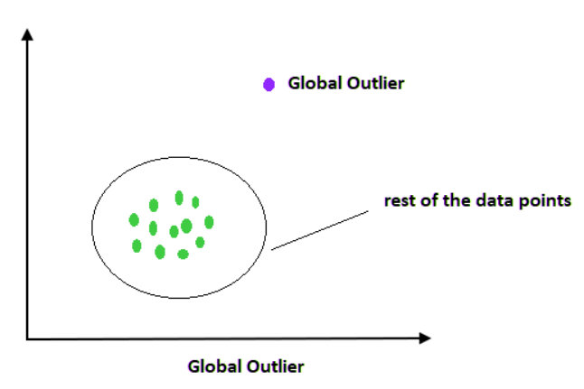
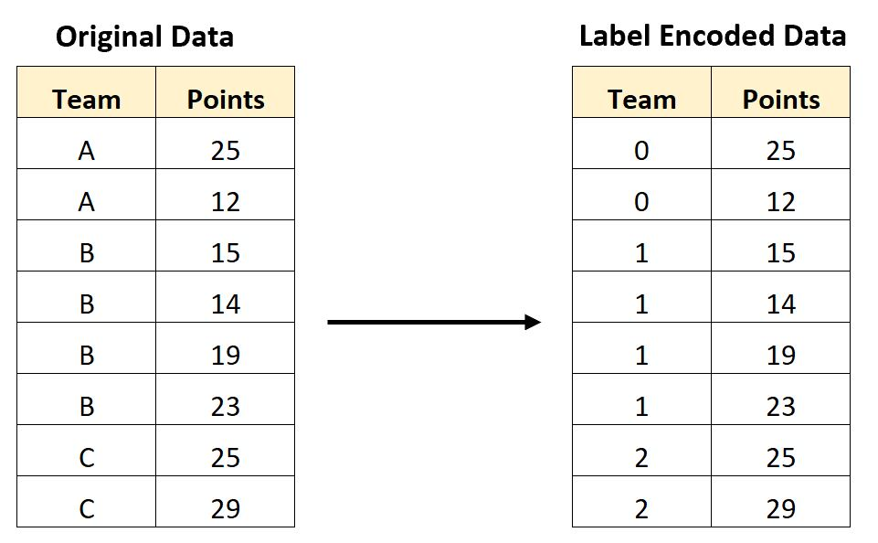

```{r setup, echo = TRUE, include=FALSE}
knitr::opts_chunk$set(echo = TRUE)
```

\pagenumbering{gobble}
\begin{centering}

\Large

{\bf DATA PRE-PROCESSING }

\vspace{1cm}

\Large

{\bf An essential step for data preparation for modelling and machine learning}

\end{centering}

\vspace{2cm}


\begin{centering}

\vspace{2cm}

\Large

{\bf Prakash Lamichhane}

\Large

{\bf Research Officer}

\Large

{\bf Data Analyst}

\Large

{\bf Ministry Of Forests and Environmentr}

\vspace{1cm}

`r Sys.Date()`

\end{centering}


\newpage

\pagenumbering{roman}

\tableofcontents

\newpage

\listoftables

\newpage

\listoffigures

\newpage


***Preface***

*This book is not intended for comprehensive academic career use but is designed as a simple tutorial on preprocessing data in R. It aims to provide practical insights and hands-on experience for readers who are looking to enhance their data preprocessing skills using R. Throughout this tutorial, we have utilized resources and inspiration from several reputable websites, including RStudio, Coursera, DataCamp, Kaggle, Swirl, StatQuest, R Bloggers, Tidyverse, EdX, Quick-R, and GeeksforGeeks. We extend our gratitude to these platforms for their invaluable resources and guidance. Additionally, for coding assistance and examples, we have also utilized AI tools such as ChatGPT and Gemini.*

*This book assumes that readers have a basic understanding of R programming and a foundational knowledge of theoretical statistics. The examples and exercises included are tailored to build upon these fundamentals, offering a step-by-step approach to mastering data preprocessing techniques. For further reading and deeper exploration, we encourage readers to visit the aforementioned websites and utilize the AI tools mentioned.*

*We hope that this book will serve as a valuable resource for anyone looking to improve their data preprocessing capabilities in R.*

Happy learning !

Prakash Lamichhane

forester.prakash@gmail.com

Research Offcier / Data Analyst

Ministry of Forest and Environment

Kathmandu, Nepal


\newpage

\pagenumbering{arabic}

# Background

## Introduction

Data pre-processing is a vital step in the data science and machine learning pipeline that involves transforming raw data into a clean and usable format. This transformation ensures that the data is suitable for analysis and modeling. The pre-processing process encompasses a variety of tasks, including handling missing values, encoding categorical variables, scaling numerical features, and detecting outliers. Additionally, it involves filtering and transforming data to correct inconsistencies and standardize formats. Raw data often comes from diverse sources and may contain errors, duplicates, or irrelevant information. Without proper pre-processing, these issues can lead to misleading results and poor model performance. Ensuring that the data is clean and well-structured is crucial for the effectiveness of machine learning algorithms, which rely on the quality of input data to learn patterns and make accurate predictions.

The necessity of data preprocessing arises from the inherent nature of real-world data, which is often messy, unstructured, and inconsistent. Raw data typically contains errors, missing values, duplicate records, and irrelevant information, making it unsuitable for direct use in machine learning models. Machine learning algorithms assume that the input data is clean, well-structured, and formatted consistently; therefore, preprocessing is essential to address these data quality issues. By cleaning and transforming the data, preprocessing ensures that the data is uniform and free from anomalies, which allows algorithms to learn more effectively and make accurate predictions.

Furthermore, preprocessing techniques play a crucial role in enhancing the efficiency of the training process. Properly scaled and encoded features ensure that algorithms converge faster and operate more efficiently, reducing computational overhead and training time. Techniques like normalization and standardization help in bringing all features to a similar scale, which is particularly important for algorithms that rely on distance metrics or gradient descent optimization. Additionally, preprocessing can improve the overall performance of the model by reducing the influence of outliers, minimizing noise, and ensuring that the data distribution aligns with the assumptions of the learning algorithm.


Overall, effective data preprocessing not only improves model accuracy but also increases the robustness and generalizability of the results. It helps in creating models that perform well on unseen data by mitigating issues that could lead to overfitting or poor generalization. In summary, preprocessing transforms raw, chaotic data into a clean, structured format, laying a solid foundation for building reliable and high-performing machine learning models.

In this tutorial, we will delve into essential data pre-processing techniques using R, a powerful tool for9 statistical computing and graphics. The tutorial will guide the audience through practical steps to clean and prepare their data sets, covering methods for handling missing values, encoding categorical data, and scaling features. By the end of this tutorial, participants will have a thorough understanding of how to preprocess their data effectively, setting a solid foundation for building accurate and reliable machine learning models in R.


## Importance of Data Preprocessing

Data preprocessing is a crucial step in the machine learning pipeline, significantly impacting the performance of models. The primary goal of data preprocessing is to transform raw data into a clean and usable format. Here's why it's important, along with some practical examples:

***1. Improving Model Accuracy***

- Consistency and Uniformity: Preprocessing ensures that data is consistent and uniform, which is critical for accurate model training. For instance, scaling numerical features to a similar range can help models converge faster and perform better.

- Example: Suppose you have a dataset with features like age (0-100) and income (0-100,000). Without scaling, the model might give undue weight to the income feature because of its larger range. Scaling ensures both features contribute equally.

***2. Handling Missing Values***

- Completeness: Models cannot work effectively with incomplete data. Preprocessing techniques like imputation fill in missing values, allowing the model to use all available data.

- Example: In a healthcare dataset, missing values for patient blood pressure can be imputed using the mean or median of the existing blood pressure values, ensuring no data point is discarded.

***3. Encoding Categorical Variables***

- Machine Learning Compatibility: Algorithms require numerical input, so categorical variables need to be encoded into a numerical format. Proper encoding ensures that these variables are interpreted correctly by the model.

- Example: A dataset with a 'color' feature (red, blue, green) can be encoded using one-hot encoding, converting it into binary columns for each color.

***4. Enhancing Model Training Efficiency***

- Reduced Complexity: By normalizing or standardizing data, the algorithm can operate more efficiently, leading to faster convergence and better performance.

- Example: In a dataset with features of varying scales, normalizing the data to a common scale can help gradient descent algorithms converge more quickly during training.

***5. Improving Model Interpretability***

- Clearer Insights: Well-preprocessed data can make it easier to understand the relationships between features and the target variable, leading to more interpretable models.

- Example: Standardizing features can help identify which variables have the most significant impact on the prediction outcome by making the coefficients comparable in models like linear regression.

***6. Preventing Data Leakage***

- Proper Splitting: Preprocessing ensures that transformations are applied correctly, preventing data leakage from the training set into the validation or test sets.

- Example: When normalizing data, it's crucial to calculate normalization parameters (mean, standard deviation) only on the training set and then apply these parameters to both the training and test sets to avoid data leakage


\newpage

# Missing Data Handling

##  Introduction

Missing data, or missing values, occur when no data value is stored for a variable in an observation. In data sets, this appears as blank cells or placeholders indicating the absence of a value or "NA".


***Example of Missing Data***

-   **Empty cells in a spreadsheet:** When certain field are left blank during data entry.

-   **'NA' values in R:** R uses 'NA' to indicate missing values in data sets.

-   **Null entries in Data base:** Data base might store missing information as 'NULL'.

Handling missing data is crucial for accurate data analysis, as ignoring or improperly managing it can lead to biased results and invalid conclusions.

## Causes of Missing Data

1.  **Data Collection Errors:**

-   *Human Error*: Mistakes during data entry, recording, or transcription.

-   *Equipment Failure*: Malfunctioning devices during data collection can result in missing values.

2.**Non-response:**

-   *Survey Non-response*: Participants may skip questions or entire surveys.

-   *Dropouts*: Subjects in longitudinal studies may leave the study before completion.

3.**Data Processing Issues:**

-   *Data Corruption*: Issues during data transfer or storage can lead to lost or corrupted data.

-   *Incorrect Data Merging*: Merging data sets without proper alignment can introduce missing values.

4.**Design Flaws:**

-   *Inadequate Questionnaire Design*: Poorly designed questions may be misunderstood or left unanswered.

-   *Unplanned Changes*: Modifications to study protocols or measurement tools can create inconsistencies.

5.**Intentional Omission:**

-   *Privacy Concerns*: Participants may withhold sensitive information.

-   *Selective Reporting*: Researchers might selectively omit data deemed irrelevant or outliers.

6.**Conditional Data:**

-   *Logical Missingness:* Certain values are missing by design due to logical conditions within the study (e.g., follow-up questions only answered by certain respondents).

## Types of Missing Data

Missing data are errors because your data don’t represent the true values of what you set out to measure.

The reason for the missing data is important to consider, because it helps you determine the type of missing data and what you need to do about it. There are three main types of missing data.

```{r, tidy=TRUE, comment=NA, echo=FALSE}
tab <- data.frame(Type = c("Missing Completely at random (MCAR)","Missing at random (MAR)","Missing not at random (MNAR)"),
                  Definition = c("Missing Data are randomly distributed across the variable and unrelated to other variables.","Missing data are not randomly distributed but they are accounted for other observed variables","Missing data systematically differ from the observed values"))

knitr::kable(tab, caption = "Types of Missing Data")
```

Data preprocessing encompasses a range of crucial techniques essential for transforming raw data into a format suitable for analysis and modeling. These techniques include handling missing values, encoding categorical variables, scaling numerical features, and managing outliers.

Handling missing values involves strategies such as imputation, where missing values are replaced with statistical measures like the mean, median, or mode of the feature, or deletion of incomplete records when appropriate. Encoding categorical variables converts non-numeric data into a numerical format that machine learning algorithms can process. Techniques include label encoding, assigning unique integers to each category, or one-hot encoding, creating binary columns to represent each category.

Scaling numerical features ensures that variables are on a comparable scale, which is crucial for algorithms that rely on distance metrics or gradient-based optimization. Techniques like normalization re scale data to fit within a specific range (e.g., [0, 1]) and standardization transform data to have a mean of 0 and a standard deviation of 1.

Managing outliers involves identifying and addressing data points that significantly differ from the majority of the data. Techniques include transformation (e.g., log transformation) to reduce the impact of outliers or removal if they are deemed to be noise or errors.

By mastering these techniques, data scientists can preprocess data effectively, ensuring it is clean, consistent, and ready for analysis. This foundational step is essential for building accurate and robust machine learning models that can generalize well to unseen data and provide meaningful insights for decision-making.

Here, we try to encompass some of th techniques used in R.


***Example for further explanations***

> *You collect data on end-of-year holiday spending patterns. You survey adults on how much they spend annually on gifts for family and friends in dollar amounts.*

### Missing Completely at random (MCAR)

When data are missing completely at random (MCAR), the probability of any particular value being missing from your data set is unrelated to anything else.

The missing values are randomly distributed, so they can come from anywhere in the whole distribution of your values. These MCAR data are also unrelated to other unobserved variables.

***Example : MCAR Data***

> *You note that there are a few missing values in your holiday spending data set. Some people started answering your survey but dropped out or skipped a question.*

> *However, you note that you have data points from a wide distribution, ranging from low to high values.*

> *Therefore, you conclude that the missing values aren’t related to any specific holiday spending amount range.*

### Missing at random (MAR)

Data missing at random (MAR) are not actually missing at random; this term is a bit of a misnomer. This type of missing data systematically differs from the data you’ve collected, but it can be fully accounted for by other observed variables. The likelihood of a data point being missing is related to another observed variable but not to the specific value of that data point itself.

**Example: MAR data**

> *You repeat your data collection with a new group. You notice that there are more missing values for adults aged 18–25 than for other age groups.*

> *But looking at the observed data for adults aged 18–25, you notice that the values are widely spread. It’s unlikely that the missing data are missing because of the specific values themselves.*

> *Instead, some younger adults may be less inclined to reveal their holiday spending amounts for unrelated reasons (e.g., more protective of their privacy).*

### Missing not at random (MNAR)

Data missing not at random (MNAR) are missing for reasons related to the values themselves.

**Example: MNAR data**

> *In the new data set, you also notice that there are fewer low values. Some participants with low incomes avoid reporting their holiday spending amounts because they are low.*

> *This type of missing data is important to look for because you may lack data from key subgroups within your sample. Your sample may not end up being representative of your population.*


***Are missing data problematic?***

Missing data are problematic because, depending on the type, they can sometimes cause sampling bias.

This means your results may not be generalizable outside of your study because your data come from an unrepresentative sample.

In practice, you can often consider two types of missing data ignorable because the missing data don’t systematically differ from your observed values: MCAR data and MAR data For these two data types, the likelihood of a data point being missing has nothing to do with the value itself. So it’s unlikely that your missing values are significantly different from your observed values. On the flip side, you have a biased data set if the missing data systematically differ from your observed data. Data that are MNAR are called non-ignorable for this reason.

## Visualizing and Reporting Missing Data

It is important to visualize and inspect missing data as it provides crucial insights into the completeness and potential biases within a data set. This process can be easily accomplished in R using various packages and functions designed for data visualization. By visualizing missing data, analysts can identify patterns, assess the mechanisms behind missingness, and make informed decisions about data cleaning, imputation strategies, and overall data quality assurance. This visual exploration not only enhances the transparency of data analysis but also ensures that appropriate methods are employed to handle missing values effectively, thereby improving the reliability and validity of subsequent statistical analyses.

### Required packages in R 

some of the famous packages in R to handle the missing data are *naniar,VIM (Visualization and Imputation of Missing Values),mice (Multivariate Imputation by Chained Equations),missForest, Amelia*.

```{r, comment = NA, warning = FALSE}
# install.packages("mice")
# install.packages("VIM")
# install.packages("miscforest")
# install.packages("Amelia")
suppressPackageStartupMessages(library(dplyr))
library(mice) %>% suppressPackageStartupMessages()
library(VIM) %>% suppressPackageStartupMessages()
library(missCforest) %>% suppressPackageStartupMessages()
library(missForest) %>% suppressPackageStartupMessages()
library(Amelia) %>% suppressPackageStartupMessages()
```


### Summary and percentage of NA's

First, of all load the data set in R. The data set used here can be found by clicking [here](https://drive.google.com/file/d/1EtK9k9QjODoNWC8wj0-YGtm6J_Vm-5Fk/view?usp=sharing).

```{r loading dataset, comment = NA, tidy=TRUE}
dat <- read.csv("D:/R_projects/Data Preparations/Data_Preprocessing/Data/vehicleMiss.csv", header  = T)
str(dat)
dat$State <- as.factor(dat$State)
## Now the structure changed
str(dat)
```
So this is the database of 1624 observations i.e.,vehicles and 7 variables i.e., columns. Here, vehicle code is represented by integer 1,2,3,4...... "fm" as failure month, Mileage at the time of failure month, "lh" as labor hours i.e., the time taken to correct it, "lc" as the labor cost to correct it, "mc" as the material cost to correct it and the name of the state where the failure occurred.

Now look at the summary of the data.

```{r, comment = NA}
summary(dat)
```
The summary gives the descriptive analysis of the numerical data and the length of the character data in it. But, more importantly, it gives the glimpse of the number of NA's in the particular columns i.e., variables. Here we can find numerous missing values in Mileage, lh and lc columns.

**Lets calculate what percentage of data is missing for what variable**

```{r, comment = NA, tidy=TRUE}
# lets build a function to find the peercentage of missing data in any column
p <- function(x) {sum(is.na(x))/length(x)*100}
# X = data, 
# Margin(1 = Rows and 2 = Columns), 
# FUN = functions to apply
apply(X = dat, MARGIN = 2, FUN = p)
```
Here, you can see some of the columns like vehicle, fm and mc do not have missing values there but mileage, lh and lc have 0.8 percent, 0.36 percent and 0.49 percent of missing values respectively.The state column has the highest number of missing values in the data set i.e., 0.92 percentage.

### Missing Data Pattern

The *md.pattern()* function in R shows the missing data patterns both in table and figure. 

```{r}
library(knitr)
kable(md.pattern(dat,plot = FALSE), caption = "The matrix that shows the combination of missing values in different observations and variables.")
```


```{r, fig.cap= "Missing data Pattern in visual form"}
a <- md.pattern(dat, rotate.names = TRUE)
```

The table 2 and figure 3 both shows the quantity and placement of the missing values. The table 2 defines the number of items missed in each columns but in figure 3 it highlights which column has missing values and which does not.

According to these figure and table, the maximum number of rows i.e., 1586  have the value in it. But 11 observations have one missing value in it and that is in state column. 13 observations have missing value in it and it is in Mileage column and so on. This gives the patterns, locations and the quantity of missing values in the data set which is really helpful to solve the issues in the data base.


### Missing data pattern by variable pairs

The *mice* package has the function called *md.pairs()* which gives us the number of observations per variable pairs. It takes the data frame or matrix of incomplete data as an argument to  display the results.

The four components in the output value is have the following interpretation. 

1. list('rr') :  response-response, both variables are observed

2. list('rm'):response-missing, row observed, column missing

3. list('mr'): missing -response, row missing, column observed

4. list('mm'):missing -missing, both variables are missing

Each component is square numerical matrix containing the number observations within four missing data pattern.

**Note**: *This information can be accessed by using '?md.pairs()' in r console.*

***Lets perform the code here.***


***Response to Response***


```{r, tidy=TRUE}
result <- md.pairs(dat)

# This code will will store all 4 lists in the name of result.

# First check the first list i.e., response to response matrix

library(knitr)
kable(result$rr,
             caption = "The response to response data of the input variables in the data set")

```

In table 3 we can see the number of response variable within and between the variables. Those are the observed numbers of the data in different rows and columns of the data sets. For example, the vehicle column has 1624 rows and columns with response. 

***Response Missing***

```{r}
# Now we can see at second result the list has
library(knitr)
kable(result$rm,
             caption = "The responce missing data of the input variables in the data set")
```

The table 4 provides us the information on the response-missing within or between the variables. For example, 13 data are there which has response for mileage but not for vehicle similarly, 15 data are there to show State but not the Mileage etc. 

***Missing-response***

```{r}
library(knitr)
kable(result$mr,
             caption = "The missing responce data of the input variables in the data set")
```

The table 5 gives the information of missing response i.e., the rows missing but the column missing data. For example there are 15 data that are missing state variable but having vehicle id etc.

**Missing missing**

```{r}
library(knitr)
kable(result$mm,
             caption = "The missing missing data of the input variables in the data set")
```

Then table 6 shows the number of missing missing data i.e., both rows and column are missing. For example, there are 2 data which have missing information of both state and lh variables.


### Drawing Marginal Plots for variables

If you want to compare the response and missing values in variables, the marginal plot is one of the best ones. This gives the Scatter plot with additional information in the margins. In addition to a standard scatter plot, information about missing/imputed values is shown in the plot margins. Furthermore, imputed values are highlighted in the scatter plot. The limitations of teh margi plot is that it must be only two variables in it to compare.

```{r, fig.height = 6, fig.width = 9, fig.cap="Marginal plot between Mileage and labor cost"}
library(VIM)
# for example if we want to check the missing data in two variables
# in the mileage and labor cost variable 
marginplot(dat[,c('Mileage','lc')])
```


In the figure, Box plots for available and missing/imputed data, as well as uni variate scatter plots for missing/imputed values in one variable are shown in the plot margins. Blue dots are observed values and red dots are the missing values here. The presented numbers and the box plots are very important to interpret here. In the figure we can see, 8 points and 13 points are missing for mileage  and labor costs respectively. The vertical box plots of both missing and response mileage points illustrates the distribution. similarly, the horizontal box plots show the distribution of missing and response labor costs. These information is very crucial to determine the techniques to treat the missing observations.

Furthermore, the frequencies of the missing/imputed values can be displayed by a number (lower left of the plot). The number in the lower left corner is the number of observations that are missing/imputed in both variables.

## Techniques to Handle the missing Data

### Deletion: 

This involves removing rows or columns with missing values. This is a straightforward method, but it can be problematic if a significant portion of your data is missing. Discarding too much data can affect the reliability of your conclusions.

### Imputation
This replaces missing values with estimates. There are various imputation techniques, each with its strengths and weaknesses. Here are some common ones:

#### MICE: Multivariate Imputation by Chained Equations

The mice package implements a method to deal with missing data. The package creates multiple imputations (replacement values) for multivariate missing data. The method is based on Fully Conditional Specification, where each incomplete variable is imputed by a separate model. The MICE algorithm can impute mixes of continuous, binary, unordered categorical and ordered categorical data. In addition, MICE can impute continuous two-level data, and maintain consistency between imputations by means of passive imputation. Many diagnostic plots are implemented to inspect the quality of the imputations.

Generates Multivariate Imputations by Chained Equations (MICE)

MICE assumes that the missing data are Missing at Random (MAR), which means that the probability that a value is missing depends only on observed value and can be predicted using them. It imputes data on a variable by variable basis by specifying an imputation model per variable.

For example: Suppose we have X1, X2….Xk variables. If X1 has missing values, then it will be regressed on other variables X2 to Xk. The missing values in X1 will be then replaced by predictive values obtained. Similarly, if X2 has missing values, then X1, X3 to Xk variables will be used in prediction model as independent variables. Later, missing values will be replaced with predicted values.

By default, linear regression is used to predict continuous missing values. Logistic regression is used for categorical missing values. Once this cycle is complete, multiple data sets are generated. These data sets differ only in imputed missing values. Generally, it’s considered to be a good practice to build models on these data sets separately and combining their results.

Precisely, the methods used by this package are:

- PMM (Predictive Mean Matching)  – For numeric variables

- logreg(Logistic Regression) – For Binary Variables( with 2 levels)

- polyreg(Bayesian polytomous regression) – For Factor Variables (>= 2 levels)

- Proportional odds model (ordered, >= 2 levels)


**Lets understand it practically now.**


```{r, message=FALSE, comment = NA, warning=FALSE}
# Impute the data using mice function here
impute <- mice(data = dat[,2:7],m = 3,seed = 123)

# m = number of imputation
# seed = random seeds
# maxit = maximum iterations

```
In this result we can see there is a maximum of five iterations, 3 imputations in each iterations and the variables shown are those variables having missing values in it.

**Lets print the impute**

```{r, warning=FALSE, message=FALSE, comment = NA}
print(impute)
```

As earlier mentioned in description of mice package, the methods are displayed here. All numerical variables are imputed using "pmm" (Predictive Mean Matching) method where as the factor variable was imputed using "polyreg" (Bayesian polytomous regression) i.e., multinomial logistic regression. If other variables appear in the missing data it can use other suitable methods to fill up the data here.


**Lets see some imputed values**

```{r}
kable(impute$imp$Mileage, caption = "The imputed values for Mileage")
```

Here, the researcher should sometimes check manually or visually which imputation will be better suited by hit and trail methods. 
But, we can see the distribution of data in original and imputations so that we can choose the right imputations. For the we can observe the imputed and observed values in the data using **stripplot()** functions.

```{r, echo = FALSE}
cap <- "Distribution of observed points and imputed points. The red points indicates the imputed points. Here we can see the distribution of imputed values.But to look
at the diffrence in each imputation we need to draw a xyplot against desired variables."
```


```{r, fig.cap=cap, fig.height=3, fig.width= 6}
# Distribution of imputed / observed values, pch = shape of points, cex = size of points
stripplot(impute, pch = 20, cex = 1)
```


```{r, fig.cap="Comparision of different imputation against the observed data", fig.height=3, fig.width=6}

xyplot(impute, lc ~ lh | .imp, pch = 20, cex = 1.25)
```


when we choose any imputations, we can now complete the data using complete() function.

```{r, comments = NA}
new_Data <- complete(impute,1)# used first imputation

```

**Lets see if there are any missing data in a new new data sets**.

```{r, comment = NA}
summary(new_Data)
```
There are no any NA's in the summary. Lets see it visually using md.patters() function also.

```{r}
md.pattern(new_Data,plot = TRUE, rotate.names = TRUE )
```

Hence, the problem solved.

#### Random Forest algorithm

Some times the variables in the data set does not follow the linear relation ship In case of the non linear relationship between the variables. In case of the variables having non linear pattern of relationships the R package *miscForest* can be used.

As the name suggests, missForest is an implementation of random forest algorithm. It’s a non parametric imputation method applicable to various variable types. So, what’s a non parametric method ?

Non-parametric method does not make explicit assumptions about functional form of f (any arbitary function). Instead, it tries to estimate f such that it can be as close to the data points without seeming impractical.

How does it work ? In simple words, it builds a random forest model for each variable. Then it uses the model to predict missing values in the variable with the help of observed values.

It yield OOB (out of bag) imputation error estimate. Moreover, it provides high level of control on imputation process. It has options to return OOB separately (for each variable) instead of aggregating over the whole data matrix. This helps to look more closely as to how accurately the model has imputed values for each variable.

Let’s understand it practically. Since bagging works well on categorical variable too, we don’t need to remove them here. It very well takes care of missing value pertaining to their variable types:

```{r, warning = FALSE, comment = NA}
# MissForest
#install.packages("missForest")
library(missForest) %>% suppressPackageStartupMessages()

data("iris")

# Seed 10 % mising values in the data set

iris.miss <- prodNA(iris, noNA = 0.1)

summary(iris.miss)

```
Here we can the the imputation of missing values as NA's in the data sets. Now we can use missForest() function to impute the missing data.

```{r, comment = NA}
iris.imputed <- missForest(iris.miss, ntree = 500,mtry = 4)

## Check Imputed values 

iris.imputed$ximp %>% head(10)
```

Now we can check then error of the imputation.

```{r, comment = NA}
iris.imputed$OOBerror
```

NRMSE is normalized mean squared error. It is used to represent error derived from imputing continuous values. PFC (proportion of falsely classified) is used to represent error derived from imputing categorical values.


Again, we can compare the actual data accuracy

```{r, comment = NA}
iris.err <- mixError(iris.imputed$ximp, iris.miss, iris)
iris.err
```
This suggests that categorical variables are imputed with 14% error and continuous variables are imputed with 15% error. This can be improved by tuning the values of *mtry* and *ntree* parameter. *mtry* refers to the number of variables being randomly sampled at each split. *ntree* refers to number of trees to grow in the forest.


#### Central value imputation

***Hmisc*** is a multiple purpose package useful for data analysis, high – level graphics, imputing missing values, advanced table making, model fitting & diagnostics (linear regression, logistic regression & cox regression) etc. Amidst, the wide range of functions contained in this package, it offers powerful function called *impute()* for imputing missing values.  *impute()* function simply imputes missing value using user defined statistical method (mean, max, mean). It’s default is median. 


```{r, comment = NA, message=FALSE}
#install package and load library
# install.packages("Hmisc")
library(Hmisc)

#load data
data("iris")

# Seed missing values  (10 %)

iris.miss <- prodNA(iris, noNA = 0.1)

summary(iris)
```

Again, here we can see some the data are changed as missing data information as NA's. 

Now we can use impute function to impute the data in missing place.

```{r, comment = NA}
# impute with mean value
iris.miss$imputed_sepal_length <- with(iris.miss, impute(Sepal.Length, mean))

# Now looka the imputed observation

iris.miss %>% filter(is.na(Sepal.Length)) %>% select(Sepal.Length,imputed_sepal_length)
```

Here, we can see every NA's are filled with mean sepal length.similarly you can use min, max, median to impute missing value. But, you can use median function if the data has some extreme values or outliers.

But sometimes if the distribution of the data is near to uniform you can impute the missing values by random number too.

```{r, comment = NA}
# impute with random value
iris.miss$imputed_petal_length <- with(iris.miss, impute(Petal.Length, 'random'))

iris.miss %>% filter(is.na(Petal.Length)) %>% select(Petal.Length,imputed_petal_length)

```

Here, you can see the NA's has been filled with random numbers.


#### Bootstrapping, additive regression and predictive mean matching

The ***Himsc*** has another function called *aregImpute()* allows mean imputation using additive regression, bootstrapping, and predictive mean matching.

In bootstrapping, different bootstrap re samples are used for each of multiple imputations. Then, a flexible additive model (non parametric regression method) is fitted on samples taken with replacements from original data and missing values (acts as dependent variable) are predicted using non-missing values (independent variable).

Then, it uses predictive mean matching (default) to impute missing values. Predictive mean matching works well for continuous and categorical (binary & multi-level) without the need for computing residuals and maximum likelihood fit. The *argImpute()* automatically identifies the variable type and treats them accordingly.

*NOTE* : It assumes linearity in the variables being predicted and has *Fishers's optimum scoring method* method is used for predicting categorical variables.


```{r, comment = NA}
impute_arg <- aregImpute(~ Sepal.Length + Sepal.Width + Petal.Length + Petal.Width + Species, data = iris.miss, n.impute = 5)

impute_arg

```

Here,

- n: Number of observations in the data set (150).

- p: Number of variables involved in the imputation (5).

- Imputations: Number of imputations performed (5).

- nk: Number of knots used in the spline function for continuous variables (3).


- R-squared values represent the proportion of variance in the observed (non-missing) values of each variable that can be explained by the imputed values of the other variables. Higher R-squared values indicate better         predictive power of the imputation model:

  - Sepal.Length: 0.885 (88.5% of the variance explained)
  - Sepal.Width: 0.557 (55.7% of the variance explained)
  - Petal.Length: 0.982 (98.2% of the variance explained)
  - Petal.Width: 0.960 (96.0% of the variance explained)
  - Species: 0.987 (98.7% of the variance explained)

Variables and degree of freedom.

Type: The type column indicates whether the variable is continuous (s) or categorical (c):

- Continuous variables (s) are typically numeric and can take an infinite number of values within a range.

- Categorical variables (c) are typically factors or characters that represent discrete categories or groups.


Degrees of Freedom (d.f.):

- For continuous variables (Sepal.Length, Sepal.Width, Petal.Length, Petal.Width), the degrees of freedom (d.f.) are set to 2. This usually refers to the complexity of the spline functions used to fit the imputation model. In this context, it suggests that a relatively simple spline (with 2 degrees of freedom) was used to model the relationship for these variables.

- For the categorical variable (Species), the degrees of freedom (d.f.) are also 2. This might relate to the number of levels of the factor minus one (since degrees of freedom for categorical variables often correspond to the number of levels minus one).

\newpage

# Feature Scaling

Feature scaling is a crucial preprocessing technique in machine learning that harmonizes the scale of feature values, ensuring all contribute equally to the model. This step is particularly important when dealing with data sets where features vary widely in terms of their ranges, units, or magnitudes. By standardizing feature scales, we can prevent certain features from dominating the learning process simply because they have larger numerical values.

There are several common techniques for feature scaling, each suited to different types of data distributions and algorithm requirements. Normalization, for example, rescales feature values to a common range, typically between 0 and 1. This technique is useful when the distribution of the data does not follow a Gaussian (normal) distribution. On the other hand, standardization transforms data to have a mean of 0 and a standard deviation of 1, which is beneficial for algorithms that assume a Gaussian distribution in the input data. Additionally, min-max scaling adjusts feature values to a specified range, often between 0 and 1, making it suitable for cases where preserving the original distribution's shape is important.

Implementing these scaling techniques not only improves model performance by facilitating more efficient convergence during training but also reduces bias that could arise from features with inherently larger numerical ranges. By understanding and applying appropriate feature scaling methods, data scientists can enhance the accuracy, stability, and generalizability of their machine learning models.


Some machine learning algorithms are sensitive to feature scaling, while others are virtually invariant.Machine learning algorithms like linear regression, logistic regression, neural network, PCA (principal component analysis), etc., that use gradient descent as an optimization technique require data to be scaled. 

Distance algorithms like KNN, K-means clustering, and SVM(support vector machines) are most affected by the range of features. This is because, behind the scenes, they are using distances between data points to determine their similarity.

For example, let’s say we have data containing high school CGPA scores of students (ranging from 0 to 5) and their future incomes (in thousands Rupees):

|Student|CGPA|Salary'000|
|----|----|----|
|1|3.0|60|
|2|3.0|40|
|3|4.0|40|
|4|4.5|50|
|5|4.2|52|

:The unscaled data

Since both the features have different scales, there is a chance that higher weightage is given to features with higher magnitudes. This will impact the performance of the machine learning algorithm; obviously, we do not want our algorithm to be biased towards one feature.

Therefore, we scale our data before employing a distance based algorithm so that all the features contribute equally to the result.

|Student|CGPA|Salary'000|
|----|----|----|
|1|-1.18|1.52|
|2|-1.18|-1.10|
|3|0.44|-1.100|
|4|1.21|0.209|
|5|0.73|0.4717|

:The scaled Data

Tree-based algorithms, on the other hand, are fairly insensitive to the scale of the features. Think about it, a decision tree only splits a node based on a single feature. The decision tree splits a node on a feature that increases the homogeneity of the node. Other features do not influence this split on a feature.

So, the remaining features have virtually no effect on the split. This is what makes them invariant to the scale of the features!


## Normalization

Normalization, a vital aspect of Feature Scaling, is a data preprocessing technique employed to standardize the values of features in a dataset, bringing them to a common scale. This process enhances data analysis and modeling accuracy by mitigating the influence of varying scales on machine learning models.

Normalization is a scaling technique in which values are shifted and rescaled so that they end up ranging between 0 and 1. It is also known as Min-Max scaling.

Here is the formula for normalization:

$$X' = \frac{X - X_{min}}{X_{max}-X_{min}}\tag{1}$$

Here, $Xmax$ and $Xmin$ are the maximum and the minimum values of the feature, respectively.

- When the value of X is the minimum value in the column, the numerator will be 0, and hence X’ is 0

- On the other hand, when the value of X is the maximum value in the column, the numerator is equal to the denominator, and thus the value of X’ is 1

- If the value of X is between the minimum and the maximum value, then the value of X’ is between 0 and 1

Lets implement the normalization in R.

```{r, comment = NA}
# create a data frame with different scale of data in it.
dat <- data.frame(Age = c(19,20,21,22,22,24,24,26,27),
                  Salary = c(10000,20000,30000,40000,
            50000,60000,70000,80000,90000),
            stringsAsFactors = FALSE)
dat
```

Once the dataset is created. Now we can start implementing Feature Scaling.

By simple formula

```{r, comment = NA}
# create a function for normalization

normalize <- function(x){
  (x-min(x)/max(x)-min(x))
}

# Now apply it on the data set

normalized_dat <- as.data.frame(apply(X = dat, MARGIN = 2, FUN = normalize))

## Now print normalized data
normalized_dat
```

Using Caret Library
Let’s import the library caret and then apply Normalization.

```{r, message = FALSE, comment = NA}
#install.packages("caret")
library(caret) 

# Normalization
normalised_dat_caret <- preProcess(dat, method ="range")

dat2 <- predict(normalised_dat_caret, dat)
dat2


```

## Standardization

Standardization is another Feature scaling method where the values are centered around the mean with a unit standard deviation. This means that the mean of the attribute becomes zero, and the resultant distribution has a unit standard deviation.For example, if you had a dataset with two variables (age and height), then you would calculate their means and standard deviations before performing any statistical tests on them.

Here’s the formula for standardization:

$$X' = \frac{X - \mu}{\sigma}\tag{2}$$

$\mu$ is the mean of the feature values and $\sigma$ is the standard deviation of the feature values. Note that, in this case, the values are not restricted to a particular range.

Lets implement the normalization in R.

```{r, comment = NA}
# create a data frame with different scale of data in it.
dat <- data.frame(Age = c(19,20,21,22,22,24,24,26,27),
                  Salary = c(10000,20000,30000,40000,
            50000,60000,70000,80000,90000),
            stringsAsFactors = FALSE)
dat
```

Once the dataset is created. Now we can start implementing Feature Scaling.

By simple formula

```{r, comment = NA}
# create a function for normalization

standardize <- function(x){
  (x-mean(x))/sd(x)
}

# Now apply it on the data set

standardizeed_dat <- as.data.frame(apply(X = dat, MARGIN = 2, FUN = standardize))

## Now print normalized data
standardizeed_dat
```


\newpage 

**comparing the two data set**

```{r, warning = FALSE, fig.cap="The effect of standardized in the data", fig.height=8, fig.width=8}
# plotting two data sets
par(mfrow = c(2,2))
hist(dat$Age, xlab = "Age", main = "")
hist(standardizeed_dat$Age, xlab = "Standardized Age", main = "")
hist(dat$Salary, xlab= "Salary", main  ="")
hist(standardizeed_dat$Salary, xlab= "Standardized Salary", main = "")
```

In the figure we can see the standardization tranfer the data into nearly normal distribution.

Using Caret Library
Let’s import the library caret and then apply Normalization.

```{r, message = FALSE, comment = NA}
#install.packages("caret")
library(caret) 

# Normalization
standardized_dat_caret <- preProcess(dat, method =c("center","scale"))

dat2 <- predict(standardized_dat_caret, dat)
dat2


```

Now, the big question in your mind must be when should we use normalization and when should we use standardization? Let’s find out!


|Normalization|Standardization|
|-----|-----|
|Rescales values to a range between 0 and 1|Centers data around the mean and scales to a standard deviation of 1|
|||
|Useful when the distribution of the data is unknown or not Gaussian|Useful when the distribution of the data is Gaussian or unknown|
|||
|Sensitive to outliers|	Less sensitive to outliers|
|Retains the shape of the original distribution|Changes the shape of the original distribution|
|||
|May not preserve the relationships between the data points|Preserves the relationships between the data points|

: Difference between Normalization and Standardization

However, at the end of the day, the choice of using normalization or standardization will depend on your problem and the machine learning algorithm you are using. There is no hard and fast rule to tell you when to normalize or standardize your data. You can always start by fitting your model to raw, normalized, and standardized data and comparing the performance for the best results.

It is a good practice to fit the scaler on the training data and then use it to transform the testing data. This would avoid any data leakage during the model testing process. Also, the scaling of target values is generally not required.

\newpage

# Outlier Detection

Outliers are observations that deviate significantly from the other data points in a dataset. They appear to stand out from the majority of the data and can be either extremely high or extremely low compared to other values. Outliers can be present in any kind of data, whether it be numerical, categorical, or time-series data. Their presence can signal various phenomena, such as errors, unique events, or unusual but legitimate observations.

In numerical data, outliers may manifest as extreme values far from the central tendency, such as exceptionally high or low temperatures in a weather dataset. In categorical data, an outlier might be an unexpected category or a rare event, like an unusual customer complaint type in a service feedback dataset. For time-series data, outliers can appear as sudden spikes or drops at specific time points, indicating events like stock market crashes or unexpected equipment failures.

Outliers are crucial to identify because they can significantly influence statistical analyses and machine learning models. They can skew results, leading to inaccurate insights and poor model performance. For instance, in a dataset of house prices, a few extremely high-value properties might distort the average price, making it less representative of the typical property in the area.

Detecting and handling outliers involves understanding their nature and origins. Some outliers may represent errors that need correction or removal, while others could be valuable signals worth further investigation. For example, an outlier in medical data might indicate a rare but important condition that needs special attention.

Different techniques are employed to identify outliers, including visual methods like boxplots and scatterplots, statistical methods such as the Z-score and interquartile range (IQR), and machine learning methods like Isolation Forest and Local Outlier Factor (LOF). Each method has its strengths and is suited to different types of data and outlier characteristics.

Addressing outliers appropriately ensures the integrity and reliability of data analysis. Whether through removing erroneous data points, transforming the data, or using robust statistical methods, handling outliers is a fundamental step in data preprocessing that enhances the quality of insights and predictions derived from the data.

## Sources of Outliers

- *Measurement Errors:* These can occur due to faulty equipment, human error, or data entry mistakes. For example, a mistyped value or a malfunctioning sensor might produce an outlier.

- *Experimental Errors:* Sometimes, errors occur during the collection or experimentation phase, leading to outlier values.

- *Natural Variability:* In some cases, outliers are genuine observations representing natural variability in the data. For instance, extreme weather events or rare medical conditions can produce outliers.

- *Data Processing Errors:* Errors introduced during data cleaning, transformation, or integration can result in outliers.

- *Sampling Error:* Poor sampling methods or small sample sizes can produce outliers that do not represent the general population.


## Types of Outliers

1. *Global Outliers*: These are single data points that are far removed from the rest of the dataset.



In the figure, the blue point is extremely and unnaturally far from the group of ordinary data. In general this can be happen due to several errors but in sometimes it can be sen in with natural phenomena too.

2. *Contextual Outliers:* These data points are considered normal in some contexts but outliers in others. For example, For example, a high temperature reading may be normal in summer but an outlier in winter.


In the figure, the temperature in the month June seemed very low which is not normal but such temperature for December is normal.

3. *Collective Outliers:* A subset of data points that collectively behave differently from the rest of the dataset. While individual points may not be outliers, their collective behavior is unusual.


In the figure 6, some set of data are far from the majority, which are called as collective outliers. This can be seen in large of number of samples taken from some the population that have high heterogeneity. 

## Impact of Outliers

Outliers can have a significant impact on various aspects of data analysis and modeling. (figure 7)

- *Statistical Measures:* Outliers can skew measures such as the mean, standard deviation, and correlation coefficients, leading to inaccurate representations of the data.

- *Model Performance:* In predictive modeling, outliers can affect the training process, leading to poor model performance and unreliable predictions.

- *Assumptions of Statistical Tests:* Many statistical tests assume that the data follows a certain distribution (e.g., normal distribution). Outliers can violate these assumptions, making the tests invalid.

- *Data Interpretation:* Outliers can lead to misleading interpretations and conclusions if not properly accounted for.


## Strategies for Handling Outliers

Once identified, outliers can be handled in various ways depending on the context and the goal of the analysis:

- Removal: If outliers are due to errors, they can be removed from the dataset. However, this should be done cautiously to avoid losing valuable information.

- Transformation: Data transformation techniques such as logarithmic or square root transformations can reduce the impact of outliers.

- Capping: Also known as winsorizing, this method involves setting a maximum and minimum threshold for the data values, beyond which values are replaced with the threshold values.

- Imputation: Outliers can be replaced with more reasonable values, such as the mean or median of the data.

- Robust Statistical Methods: Using statistical methods that are less sensitive to outliers, such as median-based measures or robust regression techniques, can mitigate their impact.

## Practical Examples in R

1. **Removal**

If outliers are due to errors, they can be removed from the dataset.

```{r, comment = NA}
# Sample data
data <- data.frame(value = c(1, 2, 3, 100, 5, 6, 7, 8, 9))

# Detecting outliers using the IQR method
Q1 <- quantile(data$value, 0.25)
Q3 <- quantile(data$value, 0.75)
IQR <- Q3 - Q1

# Defining lower and upper bounds
lower_bound <- Q1 - 1.5 * IQR
upper_bound <- Q3 + 1.5 * IQR

# Removing outliers
clean_data <- data[data$value >= lower_bound & data$value <= upper_bound, ]
print(data)
print(clean_data)
```

Here, the data is cleaned as the outlier value as 100 is removed.

2. **Transformation**

Applying a transformation to reduce the impact of outliers.

```{r, comment = NA}
# Sample data
data <- data.frame(value = c(1, 2, 3, 100, 5, 6, 7, 8, 9))

# Applying logarithmic transformation
data$log_value <- log(data$value)
print(data)

```

If outlier in the data is due to natural variability and cannot remove then some of the transformation technique is used to reduce the impact of the extremeness. In the result above difference of the inliers data and outlier data is reduced using log transformation.

3. **Capping (Winsorizing)**
Replacing outliers with the nearest acceptable value.

```{r, comment = NA, tidy = TRUE}
# Sample data
data <- data.frame(value = c(1, 2, 3, 100, 5, 6, 7, 8, 9))

# Detecting outliers using the IQR method
Q1 <- quantile(data$value, 0.25)
Q3 <- quantile(data$value, 0.75)
IQR <- Q3 - Q1

# Defining lower and upper bounds
lower_bound <- Q1 - 1.5 * IQR
upper_bound <- Q3 + 1.5 * IQR

# Winsorizing
data$capped_value <- ifelse(data$value > upper_bound, upper_bound,
                        ifelse(data$value < lower_bound, lower_bound, data$value))
print(data)

```


4. **Imputation**

Replacing outliers with a more reasonable value, such as the mean or median.

```{r, comment = NA, tidy=TRUE}
# Sample data
data <- data.frame(value = c(1, 2, 3, 100, 5, 6, 7, 8, 9))

# Detecting outliers using the IQR method
Q1 <- quantile(data$value, 0.25)
Q3 <- quantile(data$value, 0.75)
IQR <- Q3 - Q1

# Defining lower and upper bounds
lower_bound <- Q1 - 1.5 * IQR
upper_bound <- Q3 + 1.5 * IQR

# Imputation with median
median_value <- median(data$value)

data$imputed_value <- ifelse(data$value < lower_bound | data$value > upper_bound, median_value, data$value)
print(data)

```

Here, the outliers are replaced by the median value.

5.**Robust Statistical Methods**

Using robust statistical methods that are less sensitive to outliers. Robust regression methods are designed to be less sensitive to outliers compared to OLS regression. The *rlm* function in the *MASS* package uses M-estimators to provide robust estimates of the regression coefficients. These methods down-weight the influence of outliers, allowing the model to provide a better fit to the majority of the data.

```{r, comment = NA, tidy=TRUE}
# Sample data
data <- data.frame(value = c(1, 2, 3, 100, 5, 6, 7, 8, 9))

# Detecting outliers using the IQR method
Q1 <- quantile(data$value, 0.25)
Q3 <- quantile(data$value, 0.75)
IQR <- Q3 - Q1

# Defining lower and upper bounds
lower_bound <- Q1 - 1.5 * IQR
upper_bound <- Q3 + 1.5 * IQR

# Load the MASS package
library(MASS)

# Fit a robust linear model
robust_model <- rlm(value ~ 1, data = data)

# Extract the robust mean (intercept)
robust_mean <- coef(robust_model)[1]

# Replace original values with robust model predictions
data$adjusted_value <- ifelse(data$value < lower_bound | data$value > upper_bound, 
                              predict(robust_model, newdata = data), data$value)

# Display the updated data
print(data)

```

\newpage

# Categorical Variables Encoding

Categorical data refers to data that can be divided into distinct groups or categories. This type of data is qualitative in nature, representing characteristics such as color, job title, or marital status. Categorical variables are often encountered in various domains including surveys, demographic studies, and marketing analysis. They typically have a finite number of possible values, known as levels or categories.

Categorical data plays a crucial role in data analysis and machine learning. It is used to identify and describe different segments of a dataset, providing insights into patterns and trends. For example, in a dataset of customer information, categorical variables like gender, occupation, and product preferences help in understanding the customer base and tailoring marketing strategies accordingly.

In statistical analysis and machine learning, models typically require numerical input. Since categorical data is inherently non-numeric, it must be transformed into a numerical format to be processed by these models. This transformation is necessary for several reasons:

1. Model Compatibility: Many machine learning algorithms, such as linear regression, support vector machines, and neural networks, require numerical input to function correctly.

2. Mathematical Operations: Numerical values enable the execution of mathematical operations, such as calculating distances or applying gradient descent, which are essential for model training.

3. Improved Performance: Proper encoding can enhance the performance and accuracy of the models by ensuring that categorical information is correctly interpreted and utilized.

**Encoding the data**

Encoding is the process of converting categorical variables into a numerical format. There are several methods to achieve this, each with its own advantages and use cases:

1. Label Encoding: This method assigns a unique integer to each category. For example, the categories "red," "green," and "blue" could be encoded as 0, 1, and 2, respectively. While simple and efficient, label encoding can introduce unintended ordinal relationships between categories.

2. One-Hot Encoding: This method creates a binary column for each category, where the presence of the category is marked with a 1 and absence with a 0. For instance, a variable with categories "cat," "dog," and "bird" would result in three binary columns. One-hot encoding avoids ordinal relationships and is widely used in practice.

3. Ordinal Encoding: This method is similar to label encoding but is used when the categorical data has a meaningful order or ranking. For example, "low," "medium," and "high" might be encoded as 0, 1, and 2, reflecting their order.

4. Binary Encoding: This method combines the benefits of label and one-hot encoding by converting the integer representation of the categories into binary form. It reduces the dimensionality of the dataset while maintaining the uniqueness of each category.

By choosing the appropriate encoding method, categorical data can be effectively transformed into a format suitable for statistical analysis and machine learning, ensuring that the information contained within these variables is fully utilized in the modeling process.

## Label Encoding

The Label encoding method is for encoding categorical variables that assigns the number value to each distinct value. For the instance, the numerical values 1, 2, and 3 might be assigned to a categorical variable with the three unique values of “red,” “green,” and “blue,” respectively. This is a technique used to convert categorical variables into numerical values by assigning a unique integer to each category. This method is straightforward and easy to implement, making it a popular choice for transforming categorical data. However, it introduces ordinal relationships between categories, which may not always be appropriate.



This technique is popular for its simplicity, memory efficient requiring less memory compared to one hot encoding especially when dealing with the large number of categories and its speed.

while this method has some cons in data modelling.One of the key limitations of label encoding is that it introduces an artificial ordinal relationship between categories, which can lead to incorrect model assumptions and interpretations. For instance, if the categories "Red," "Blue," and "Green" are encoded as 0, 1, and 2, respectively, it implies a ranking or order that does not exist in reality. This misinterpretation can negatively affect the performance and accuracy of machine learning models, especially those that rely on distance calculations or assume ordinal relationships, such as linear regression or decision trees. As a result, label encoding is not suitable for all algorithms and can lead to biased or inaccurate results. Additionally, its use is limited to categorical variables with an inherent order or ranking, making it unsuitable for variables where the categories are purely nominal and do not possess any meaningful sequence.


***Example in R***
Here's an example of how to perform label encoding in R using the caret package. Consider the following data frame as an illustration:

```{r}
# Install and load necessary packages
#install.packages("caret")
suppressPackageStartupMessages(library(caret))

# Sample data
data <- data.frame(
  Color = c("Red", "Blue", "Green", "Blue", "Red", "Green", "Red"),
  Value = sample(5:10, size = 7, replace = TRUE)
)

# Label encoding
label_encoder <- function(x) {
  factor(x, levels = unique(x), labels = seq_along(unique(x)))
}

data$Color_Encoded <- label_encoder(data$Color)

# Display encoded data
print(data)

```


The *factor()* function in R can be used to turn a category variable into a factor, as seen in the data above the colo_encoded column is of factor type, that can subsequently be turned into integers using the *as.integer()* function.

```{r}
data$Color_Encoded <- as.integer(data$Color_Encoded)
data
```

We can see the the Color_Encoded is changed into integer data.By using label encoding, we convert the categorical variable into a numerical format that can be used for further statistical analysis or machine learning modeling. However, it is important to be mindful of the potential introduction of ordinal relationships and choose the encoding method that best suits the specific requirements of your analysis.


## One-Hot Encoding

The One-Hot A method of encoding category information into a binary matrix is called encoding. A column in the matrix is given to each distinct value in the categorical variable. The corresponding column will be given a value of 1, and all other columns will be given a value of 0, if the value is present in that particular row. The technique used to convert categorical variables into a binary format where each category is represented by a binary vector. This method creates a new binary column for each category of the variable, indicating the presence (1) or absence (0) of the category. One-hot encoding avoids the problem of introducing ordinal relationships between categories, making it a preferred choice for nominal categorical data.


This methods is popular because it avoids the issue of introducing artificial ordinal relationships between categories, ensuring that the model treats all categories equally. This makes it highly compatible with many machine learning algorithms, including those that do not assume any order in the categorical variables, such as logistic regression and neural networks. Additionally, one-hot encoding is ideal for handling nominal data, which are categorical variables without any inherent order or ranking. By representing each category as a binary vector, it preserves the integrity of the data and allows for more accurate modeling and analysis.

Despite its advantages, one-hot encoding has several drawbacks. One major issue is the increased dimensionality of the dataset, especially when dealing with categorical variables with many levels. This can lead to higher computational resources and potential overfitting of the model. The resulting binary matrix can also be memory inefficient, consuming more memory and computational power due to its sparse nature. Furthermore, the interpretation of the encoded variables can become more complex, as the number of features increases, making it harder to understand the relationships and patterns within the data.

***Example in R***
Here's an example of how to perform one-hot encoding in R using the caret package.

```{r}
# Install and load necessary packages
#install.packages("caret")
suppressPackageStartupMessages(library(caret))

#install.packages("fastDummies")
suppressPackageStartupMessages(library(fastDummies))

# Sample data
data <- data.frame(
  Color = c("Red", "Blue", "Green", "Blue", "Red", "Green", "Red"),
  Value = sample(18:25, size = 7, replace = TRUE))

# One-hot encoding
data_encoded <- dummy_cols(data, select_columns = "Color", remove_first_dummy = TRUE)

# Display encoded data
print(data_encoded)

```

Here, we can see the dimensions is increased but one variable is deleted as hidden variable is predicted by other displayed variables. 

By using one-hot encoding, the categorical variable is transformed into a numerical format suitable for statistical analysis and machine learning, while avoiding the pitfalls of introducing unintended ordinal relationships. However, the increased dimensionality and potential memory inefficiency should be considered when choosing this encoding method.

## Ordinal Encoding

Ordinal encoding is a technique used to convert categorical variables into numerical values by assigning integers based on the order or rank of the categories. This method is suitable for ordinal categorical variables where the categories have a meaningful order or ranking. For example, "low," "medium," and "high" can be encoded as 0, 1, and 2, respectively.


Ordinal encoding is efficient and straightforward, making it easy to implement and understand. It is particularly useful for ordinal variables where the order of categories matters, as it allows the encoded values to reflect the inherent ranking of the categories. By leveraging the ordinal nature of the data, ordinal encoding can improve model performance, especially for algorithms that can handle ordinal relationships, such as decision trees and gradient boosting machines. This method ensures that the encoded numerical values carry meaningful information about the order of the categories, which can be crucial for accurate modeling and analysis.

Despite its advantages, ordinal encoding can introduce issues if applied to nominal data, where the categories do not have a meaningful order. This can lead to incorrect assumptions and biased model results, as the algorithm may interpret the encoded values as having an inherent order when there is none. Additionally, ordinal encoding may not be suitable for all machine learning algorithms, particularly those that do not handle ordinal relationships well, such as k-nearest neighbors and certain types of neural networks. The misuse of ordinal encoding can result in misleading insights and reduced model performance, emphasizing the importance of applying this technique only to appropriate ordinal variables.

***Example in R***

Here's an example of how to perform ordinal encoding in R using the dplyr package.

```{r}
# Install and load necessary packages
#install.packages("dplyr")
library(dplyr)

# Sample data
data <- data.frame(
  Education = c("High School", "Bachelors", "Masters", "PhD", "Bachelors", "Masters", "High School"),
  Value = sample(0:100, size = 7, replace = TRUE)
)

# Define the order of categories
education_levels <- c("High School", "Bachelors", "Masters", "PhD")

# Ordinal encoding
data <- data %>%
  mutate(Education_Encoded = as.integer(factor(Education, levels = education_levels)))

# Display encoded data

print(data)

```

By using ordinal encoding, the categorical variable is transformed into a numerical format that reflects the inherent order of the categories. This method is suitable for ordinal variables, but care must be taken to ensure that it is not applied to nominal data, which could lead to incorrect model assumptions and results.


## Binary Encoding

Binary encoding is a technique for encoding categorical variables with a large number of categories, which can pose a challenge for one-hot encoding or label encoding. Binary encoding converts each category into a binary code of 0s and 1s, where the length of the code is equal to the number of bits required to represent the number of categories.In other words it is a technique used to convert categorical variables into numerical values by first assigning each category a unique integer, and then converting these integers into their binary representation. Each binary digit is placed in a separate column, with each column representing a specific power of two. This method reduces the dimensionality of the dataset compared to one-hot encoding, while still ensuring that each category is uniquely represented.


Binary encoding strikes a balance between label encoding and one-hot encoding, offering several advantages. It reduces the dimensionality of the dataset compared to one-hot encoding, which can be particularly beneficial when dealing with categorical variables with many levels. This reduction in dimensionality helps in conserving memory and computational resources, making the encoding process more efficient. Additionally, binary encoding maintains the uniqueness of each category without introducing artificial ordinal relationships, thus preserving the integrity of the categorical data.

However, binary encoding also has its drawbacks. One potential issue is the complexity it introduces, as the binary representation of categories can be less intuitive and harder to interpret compared to simple label or one-hot encoding. This increased complexity can make the encoded data more challenging to understand and analyze. Furthermore, some machine learning algorithms may still misinterpret the encoded values as having an ordinal relationship, although this risk is generally lower than with label encoding. Careful consideration and testing are required to ensure that binary encoding is appropriate for the specific dataset and model being used.

***Example in R***

Here's an example of how to perform binary encoding in R using the *tibble* and *dplyr* packages in R.

```{r}
# Install and load necessary packages
# install.packages("tibble")
# install.packages("dplyr")
suppressPackageStartupMessages(library(tibble))
suppressPackageStartupMessages(library(dplyr))

# Sample data
df <- data.frame(
  Color = c("Red", "Blue", "Green", "Blue", "Red", "Green", "Red"),
  Value = c(6, 6, 6, 8, 10, 5, 8)
)

# Perform binary encoding manually
unique_colors <- unique(df$Color)  # Get unique categories

# Create binary encoded columns
for (color in unique_colors) {
  df[paste0("Color_", color)] <- ifelse(df$Color == color, 1, 0)
}

print(df)

```


This simplified approach manually demonstrates how binary encoding works by converting categorical variables into binary columns based on the presence of each category. This method is straightforward and avoids the complexity of using additional functions or packages.


## Choosing an Encoding Method

The kind of analysis or model being utilised, as well as the characteristics of the data, influence the encoding technique selection. While Label Encoding and Frequency Encoding are frequently used for categorical variables with a lesser number of unique values ,One-Hot Encoding is frequently utilised for categorical variables with a large number of unique values.

It is crucial to remember that Frequency Encoding and Label Encoding both have the potential to inject unexpected ordering or hierarchy into the data, which could have an impact on the validity of the analysis or model. One-Hot Encoding may be a better encoding technique in some circumstances.

## Difference between all of them

Different encoding methods are available in R that can be used to convert categorical variables into numerical representations that computer learning systems can quickly understand. Here are the distinctions between three widely used encoding methods: label, frequency, and one-hot encoding.

One-hot encoding is a method for converting categorical variables into binary vectors. This encoding method uses a binary vector to symbolise each category, with only one element set to 1 and the others set to 0. A categorical variable with the three groups A, B, and C, for instance, can be represented as [1, 0, 0], [0, 1, 0], and [0, 0, 1], respectively. When there are few groups and we need to sort through them quickly.

Frequency encoding is a method for representing categorical factors based on how frequently they appear in the data. Each group is given a numerical value in this encoding method based on how frequently it appears in the data. For instance, we can represent a categorical variable as 0.25, 0.5, and 0.75 if it has three categories, A, B, and C, and their relative frequencies are 10, 20, and 30. When there are many categories and we want to record information about how often each category occurs, this method can be helpful.Frequency encoding is a method for representing categorical factors based on how frequently they appear in the data. Each group in this encoding method receives.

|Name of Method|Type of Variable|Support High Cardinality|Handle Unseen Variables|Limitations of the method|
|-|-|-|-|-|-|
Label Encoding|Nominal|Yes|No|Unseen variables categories interpreted as numerical values
||||||
Ordinal Encoding|Ordinal|Yes|Yes|Categories interpreted as numerical values|
||||||
|One hot Encoding|Nominal|No|Yes|Dummy variable Trap Large dataset|
||||||
|Binary Encoding|Nominal|Yes|Yes||

: Difference of the various Encoding Technique


By giving each category a different numerical value, the label encoding method is used to represent categorical variables. Each category is given a numerical value in this encoding method based on the order or location in the data. For instance, we can express the three categories A, B, and C of a categorical variable as 1, 2, and 3 respectively. When there is an ordinal relationship between a limited number of categories, this technique is helpful.


\newpage

# Train-Test data Splitting

When developing machine learning models, it's crucial to evaluate their performance on data that the model hasn't seen during training. This is where the concept of train-test split comes into play:

- **Train Set:** This portion of the dataset is used to train the machine learning model. It consists of examples (rows) with input features (predictors) and corresponding target variables (labels or outcomes).

- **Test Set:** This portion of the dataset is used to evaluate the trained model's performance. It serves as an unseen dataset during training and allows us to estimate how well the model generalizes to new, unseen data.

The dplyr package in R is used to perform data manipulations and operations. It can be loaded and installed into the R working space using the following command : 

```{r}
# installing the library 
library("dplyr") 
# creating a data frame 
df = data.frame(col1 = c(1:15),col2 = letters[1:15],
                col3 = c(0,1,1,1,0,0,0,0,0,1,1,0,1,1,0)) 
training_dataset <- df %>% dplyr::sample_frac(0.7) 
testing_dataset <- dplyr::anti_join(df, 
									training_dataset, by = 'col1')
knitr::kable(df, caption = "The total data set")
knitr::kable(training_dataset, caption = "The Training Dataset", align = "c")
knitr::kable(testing_dataset, caption = "The Testing Dataset", align = "c")

```


\newpage

# Conclusion

Data preprocessing is a pivotal and often underestimated phase in the data science workflow. Throughout this book, we have explored the myriad techniques and methodologies essential for transforming raw data into a clean, reliable, and analysis-ready format.

We began with the fundamentals of handling missing data, a common issue that can significantly skew results if not addressed properly. By employing techniques such as imputation, deletion, and the use of algorithms robust to missingness, we can ensure that our datasets remain robust and informative.

Next, we delved into outlier detection and treatment, learning how to identify anomalies that can distort statistical analyses and model performance. Through various statistical and machine learning methods, we developed strategies to either correct or appropriately account for these outliers.

Feature scaling and normalization were covered extensively, highlighting their importance in algorithms that rely on distance measurements. Techniques such as min-max scaling, standardization, and robust scaling ensure that our features contribute equally to model performance, preventing certain variables from dominating due to their scale.

Categorical data, another critical aspect of preprocessing, was addressed with detailed discussions on encoding techniques. We explored label encoding, one-hot encoding, and other methods to convert categorical variables into numerical formats that can be effectively utilized by machine learning algorithms.

Furthermore, we examined feature engineering and selection, which are key to enhancing model accuracy and interpretability. By creating new features, selecting the most relevant ones, and eliminating redundant or irrelevant data, we can significantly improve the efficiency and effectiveness of our models.

Throughout the chapters, practical examples in R were provided to illustrate each concept, ensuring that readers can apply these techniques to their own data projects. The goal has been to empower data practitioners with the tools and knowledge needed to preprocess data proficiently, ultimately leading to more accurate and reliable models.

As you continue your journey in data science, remember that high-quality data preprocessing is the cornerstone of successful analytics and modeling. The techniques covered in this book are not just theoretical but practical solutions to common data challenges. Keep experimenting, practicing, and refining your skills to stay ahead in the ever-evolving field of data analytics.

Thank you for investing your time in this book. We hope it serves as a valuable resource, guiding you through the complexities of data preprocessing and helping you achieve excellence in your data science endeavors.


